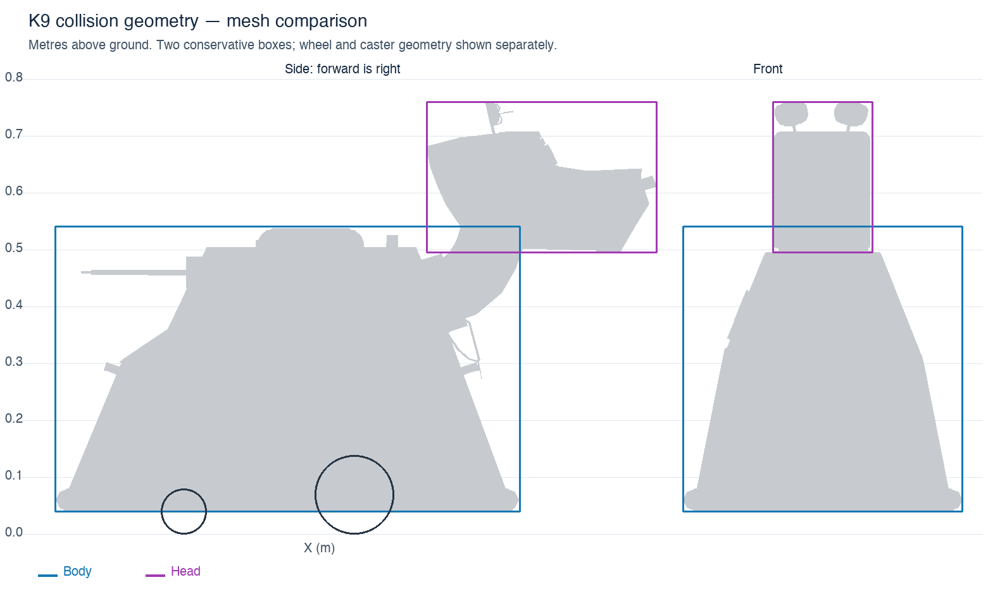

# K9 simulation geometry and motor behaviour

## Confirmed dimensions and assumptions

The owner confirms the 0.2022 m wheel-centre spacing and approximately 30 kg total
mass. The narrow track is intentional: the body sides slope inward. The model
mass remains **29.87 kg**, with a calculated centre of mass approximately 0.2165 m
above ground and 0.0407 m behind the drive axle at the default ear positions.

The back-panel LD06 is intentionally mounted where it sees K9's head. Its pose,
scan and mesh are unchanged. This is an expected self-return, not a placement
error; any later Nav2 scan masking must match the real robot.

## Ear sensor mounting

Each ear servo axis tilts 7 degrees from vertical, with a further 30-degree
downward sensor mount relative to the rotating ear. At zero servo position the
beam points 37 degrees below horizontal. During a sweep its elevation varies
because rotation occurs around the tilted servo axis.

The fixed `l_ear_sensor_link` and `r_ear_sensor_link` frames describe the beam
origins and directions, including the existing 7.5 mm forward offset from each
ear pivot. Gazebo sensor poses match these frames; ear scan messages name the
sensor frames rather than the servo links. Joint positions, limits, scan topics
and mounting heights are unchanged.

## Camera mounting still to be calibrated

The current OAK mount is level at `(0.26, 0, 0.255)` relative to `base_link`,
which puts its mounting frame 0.3244 m above nominal ground. The owner's intended
optical-axis height is 0.26 m with zero pitch; the current physical placement is
temporary and tilted. This commit preserves the deployed model rather than
substituting a guessed calibration. Resolve the mounting frame versus optical
centre offset and measure the final pose before using OAK points in a
robot-relative costmap. The adaptive floor filter does not correct mounting TF.

## Collision geometry



Two boxes replace the old full-height box. Positions below are measured from
`base_footprint` (ground level); the Xacro subtracts wheel radius when expressing
heights in `base_link`.

| Part | Centre X, Y, Z (m) | Size X, Y, Z (m) | Pitch |
| --- | --- | --- | --- |
| Body | -0.1175, 0, 0.2900 | 0.815, 0.490, 0.500 | 0 |
| Head | 0.3290, 0, 0.6275 | 0.404, 0.174, 0.265 | 0 |

The neck is already completely covered by the union of the body and head boxes;
a separate neck collision is redundant and has been removed.

These are conservative envelopes, not an exact reconstruction of the tapered
shell. The body includes the skirt and back-panel fittings, and the head includes
the mesh ears. Static checks cover every STL vertex, triangle centroid and edge
midpoint. The lowest body collision is 0.04 m above ground; the highest head
collision is 0.76 m. Empty space beside the head is no longer filled by the body
box. The two collisions share the existing chassis link and add no mass.

Default self-collision stays disabled: the broad body envelope overlaps parts of
the drive-wheel and caster volumes, as expected for this simple envelope of a
hollow, tapered body. Enabling self-collision would require a more detailed shell.

## Inertias

Battery and combined motor masses remain 5 kg and 3 kg. Their inertias now use
uniform solid-box formulas from their declared dimensions; these are explicit
approximations, not measurements of the internal mass distribution.

| Component | Ixx, Iyy, Izz (kg m²) |
| --- | --- |
| Battery, 0.25 × 0.20 × 0.25 m | 0.0427083, 0.0520833, 0.0427083 |
| Motors, 0.20 × 0.20 × 0.10 m | 0.0125, 0.0125, 0.0200 |
| Each 1 kg drive wheel | 0.00125617, 0.00240818, 0.00125617 |
| 0.5 kg caster sphere | 0.00032, 0.00032, 0.00032 |

Wheel inertia uses a uniform cylinder with its axle along link **Y**, matching the
joint axis and rotated cylinder geometry. The existing chassis mass, centre of
mass and tensor remain estimates; no arbitrary retuning was applied to them.

## Rolling caster and the final SDF

Gazebo uses a native, unactuated **ball joint**: three rotational degrees of
freedom, with the sphere centre fixed relative to the chassis. This avoids a
three-hinge approximation and its artificial intermediate masses/singularities.

URDF does not have a ball-joint type. The Xacro therefore retains a fixed nominal
`ball_caster_joint` plus `preserveFixedJoint=true`. The common converter in
`k9_robot_bringup/model.py` runs `gz sdf -p`, verifies that the caster survived
conversion, and changes that joint to SDF `type="ball"`. Both the simulation
launch and `export_model` use this converter. The launch spawns the converted SDF,
not the raw URDF. Missing caster links/joints fail conversion rather than silently
reverting to a sliding support.

The ROS URDF retains a nominal, nonrotating caster frame. This does not represent
the ball's instantaneous material orientation, which is irrelevant to its
spherical geometry and carries no sensor. The caster has no motor/control
interface, so the controller manager cannot lock it. `gz_ros2_control` may log
that this multi-axis joint is unsupported and skip it; that is expected because
Gazebo physics, not a ROS controller, owns the passive ball joint.

The existing isotropic contact friction of 0.2 is retained for rolling traction;
it no longer makes the support inherently slide because rotation is now free.
The sphere is idealised: bearing losses, rolling resistance and socket mechanics
are not yet calibrated. Check low-speed turns and free rolling on the live host.

Do not spawn the raw URDF if rolling-caster behaviour is required. Export with:

```bash
ros2 run k9_robot_bringup export_model /tmp/k9-generated-model
```

## Recommended motor model (not implemented in this change)

The adjacent **k9_driver_pkg** repository (ROS package name **k9_drive_pkg**)
contains calibration in `docs/DESIGN.md`, `config/drive_controller.yaml`,
`urdf/k9_ros2_control.xacro` and the hardware implementation. It records:

| Quantity | Recorded value | Converted value |
| --- | --- | --- |
| Encoder scale | 200 counts/rev, 0.002179 m/count | 0.0693597242 m effective radius |
| Operational wheel-speed ceiling | 642 counts/s | 20.1690 rad/s; 1.398918 m/s at the tread |
| Acceleration | 128 counts/s² | 4.02124 rad/s²; 0.278912 m/s² |
| Normal deceleration | 256 counts/s² | 8.04248 rad/s²; 0.557824 m/s² |
| Explicit zero/emergency deceleration | 512 counts/s² | 16.08495 rad/s²; 1.115648 m/s² |
| M1 speed PID calibration | P=10.644, I=2.206, D=0, QPPS=1987 | Controller-specific units |
| M2 speed PID calibration | P=9.768, I=2.294, D=0, QPPS=1837 | Controller-specific units |

The hardware also limits both wheels together, preserving commanded curvature,
using the radius-dependent speed ceiling
`642 * (1 - 0.9 / (abs(turn_radius_m) + 1))` counts/s. It rounds commands to encoder
counts/s. The QPPS calibration values 1987 and 1837 are **not** operational limits
and should not be treated as verified free-running motor speeds.

Recommended implementation:

1. Keep `diff_drive_controller` as the body-to-wheel controller, shared with the
   real robot. Add a K9-specific Gazebo system implementation behind its wheel
   velocity interfaces; do not connect the real serial hardware plugin to Gazebo.
2. First reproduce the measured/configured wheel-level behaviour: common scaling
   for speed/turn limits, acceleration versus braking selection, explicit-zero
   stopping, encoder scale and watchdog behaviour. Body-level limits alone do not
   reproduce combined translation/turning or the driver's wheel-level ceiling.
3. For load-sensitive motor dynamics, let a velocity PI loop apply bounded wheel
   torque to Gazebo, with anti-windup and a speed-dependent torque envelope. Keep
   wheel position/velocity feedback from physics. Calibrate transient response
   from encoder logs and torque limits from motor/gearbox/current data.

The inspected repository does **not** identify the scooter motor model, gear
ratio, torque constant, winding resistance, rotor inertia or torque-speed curve.
The RoboClaw 2x15A identification and 24 V supply alone do not determine wheel
stall torque. Do not copy the firmware PID gains directly into a torque PI loop:
the controller's units and internal scaling differ.

The current generic Gazebo velocity interface remains in use. It directly sets
joint velocity and is not a calibrated scooter motor model. The simulation YAML
also still has its earlier 0.28 m/s² symmetric ramp and 0.63 rad/s angular cap;
matching the hardware's full behaviour is a separate implementation step.
The tiny radius difference (0.0694 m geometry versus 0.0693597242 m calibrated
rolling radius, about 0.058%) should be reconciled when doing that calibration.

References:

- [Gazebo ROS 2 control interfaces and custom simulation systems](https://control.ros.org/jazzy/doc/gz_ros2_control/doc/index.html)
- [SDF joint types, including ball joints](https://sdformat.org/spec/1.10/joint/)
- [URDF fixed-joint preservation during conversion](https://sdformat.org/tutorials/specification/sdformat_urdf_extensions/)

## Validation status

Static tests check mesh coverage, ground clearance, inertia formulas, unchanged
mass and drive geometry, preserved caster export metadata, and the SDF joint
transformation. A test performs the actual Gazebo conversion when `gz` is present;
it is explicitly skipped on the development Mac where Gazebo is unavailable.

On the Jazzy/Harmonic host, rebuild, run the tests, export the model and check:

```bash
python3 -m unittest discover -s tests -v
ros2 run k9_robot_bringup export_model /tmp/k9-generated-model
gz sdf -k /tmp/k9-generated-model/k9_robot.sdf
ros2 launch k9_robot_bringup k9_robot_gazebo.launch.py
```

Verify a passive ball joint in the final SDF, two chassis collision shapes,
normal wheel/ear controller activation, stable settling, forward/reverse movement
and slow turns with the caster rolling. Physical dynamics and converter/plugin
compatibility remain pending this live validation.
